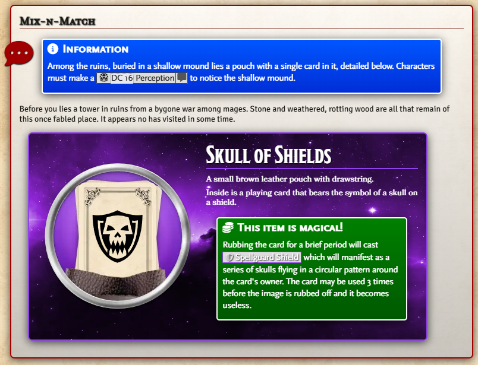

# Foundry VTT APSJ Journal Styles

 

## Installation

In the setup screen, use the URL https://github.com/turthalion/apsj-styles/releases/latest/download/module.json to install the module.

### Usage

As GM go to the **Manage Modules** options menu in your **World Settings** tab then enable the **APSJ Styles** module.

This module adds the APSJ Styles from Monk's Enhanced Journal back into the system in a v13 friendly way.

I created this mainly because I'm a heavy user of the read aloud and dialogue styles from Monk's Enhanced Journal, and a lot of my past session notes and journals for upcoming campaigns lost a lot of their oomph with the v13 upgrade.

My goal was to get the styles working so my existing journal entries would look how they used to. Ideally, this module will become obsolete when Monk's Enhanced Journal is ported to v13.

Automatic font insertion seems to no longer be supported, at least not in the same way. If you want to take advantage of the chosen fonts for panels and blocks, you should install the following fonts (available in [Monk's Enhanced Journal's github repo](https://github.com/ironmonk108/monks-enhanced-journal/tree/main/fonts) or the original [APSJ](https://github.com/AmazingVanish/apsj/tree/main/fonts)) using the following family names in the Foundry UI. I have maintained the same names, spacing, and capitalizations as Monk used:

| Font Family        | Font Weight | Font Style    | Font File                       |
|--------------------|-------------|---------------|---------------------------------|
| Bookinsanity       | Bold 700    | Italic        | Bookinsanity Bold Italic.otf    |
| Bookinsanity       | Bold 700    | Normal        | Bookinsanity Bold.otf           |
| Bookinsanity       | Regular 400 | Italic        | Bookinsanity Italic.otf         |
| Bookinsanity       | Regular 400 | Normal        | Bookinsanity.otf                |
| MrEaves            | Bold 700    | Normal        | Mr Eaves Small Caps.otf         |
| ScalySans          | Bold 700    | Italic        | Scaly Sans Bold Italic.otf      |
| ScalySans          | Bold 700    | Normal        | Scaly Sans Bold.otf             |
| ScalySans          | Regular 400 | Italic        | Scaly Sans Italic.otf           |
| ScalySans          | Regular 400 | Normal        | Scaly Sans.otf                  |
| ScalySansCaps      | Bold 700    | Italic        | Scaly Sans Caps Bold Italic.otf |
| ScalySansCaps      | Bold 700    | Normal        | Scaly Sans Caps Bold.otf        |
| ScalySansCaps      | Regular 400 | Italic        | Scaly Sans Caps Italic.otf      |
| ScalySansCaps      | Regular 400 | Normal        | Scaly Sans Caps.otf             |

The various text styles all have default sizes associated with them but if you wish to change the font size after applying a style, you can do it by
editing the HTML directly. For example, here is a Stylish Data block with a larger font size specified:

`
Stylish Data
`

## Media

The new Text Styles can be found under the Stylish Text submenu in the Format menu at the left of the toolbar in the ProseMirror editor.

_The available Elements Stylings:_

_The available Stylish blocks, dialogues, and panels menus:_

_The available Panels:_

_The available Blocks:_

_The available Elements Stylings:_

_An example of Mixing and Matching elements:_

## Thanks

With kind thanks to Monk and Arius Planewalker for their great modules.

## License

This package is under a [GPL3 license](LICENSE) and the [Foundry Virtual Tabletop Limited License Agreement for module development](https://foundryvtt.com/article/license/).

## Bugs

You can submit bugs via [Github Issues](https://github.com/turthalion/apsj-styles/issues/new/choose).

