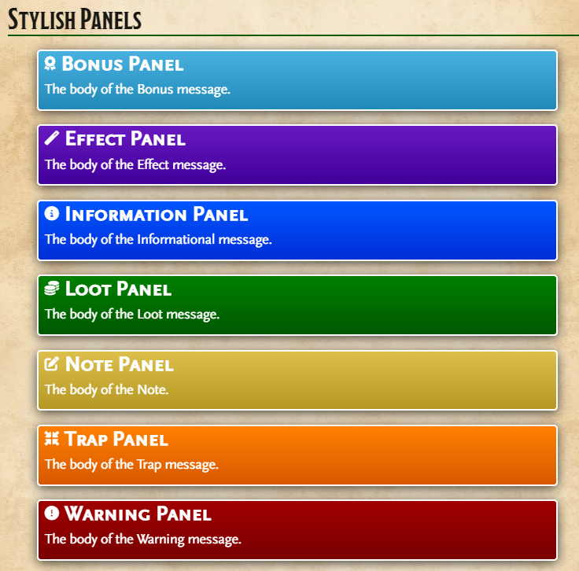

# Foundry VTT APSJ Journal Styles

## Installation

### Usage as a Module

You can install this module automatically by specifying the following public module URL:

`https://github.com/turthalion/apsj-styles/releases/latest/download/module.json`

As GM go to the **Manage Modules** options menu in your **World Settings** tab then enable the **APSJ Styles** module.

This module adds the APSJ Styles from Monk's Enhanced Journal back into the system in a v13 friendly way.

I created this mainly because I'm a heavy user of the read aloud and dialogue styles from Monk's Enhanced Journal, and a lot of my past session notes and journals for upcoming campaigns lost a lot of their oomph with the v13 upgrade.

I don't intend to do much maintenance on this module—my goal was to get the styles working so my existing journal entries would look how they used to.

Automatic font insertion seems to no longer be supported, at least not in the same way. If you want to take advantage of the chosen fonts for panels and blocks, you should install the following fonts (available in [Monk's Enhanced Journal's github repo](https://github.com/ironmonk108/monks-enhanced-journal/tree/main/fonts) or the original [APSJ](https://github.com/AmazingVanish/apsj/tree/main/fonts)) using the following family names in the Foundry UI. I have maintained the same names, spacing, and capitalizations as Monk used:
* Bookinsanity
* DungeonDropCase
* MrEaves
* ScalySans
* ScalySansCaps

## Media

_The available Panels:_

_The available Blocks:_

_The available Elements stylings:_

_The available Elements Stylings in Prosemirror:_

_The available Elements Stylings in TinyMCE:_

_An example of Mixing and Matching elements:_

